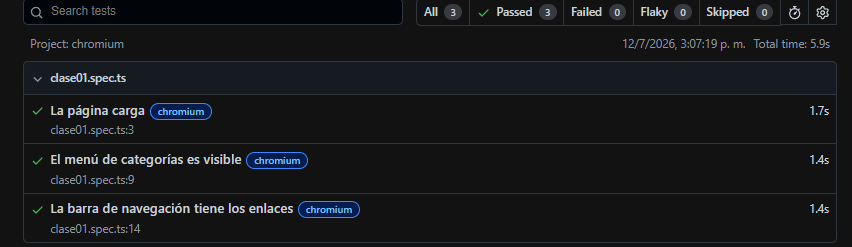
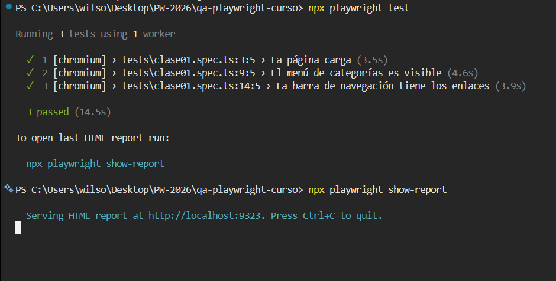
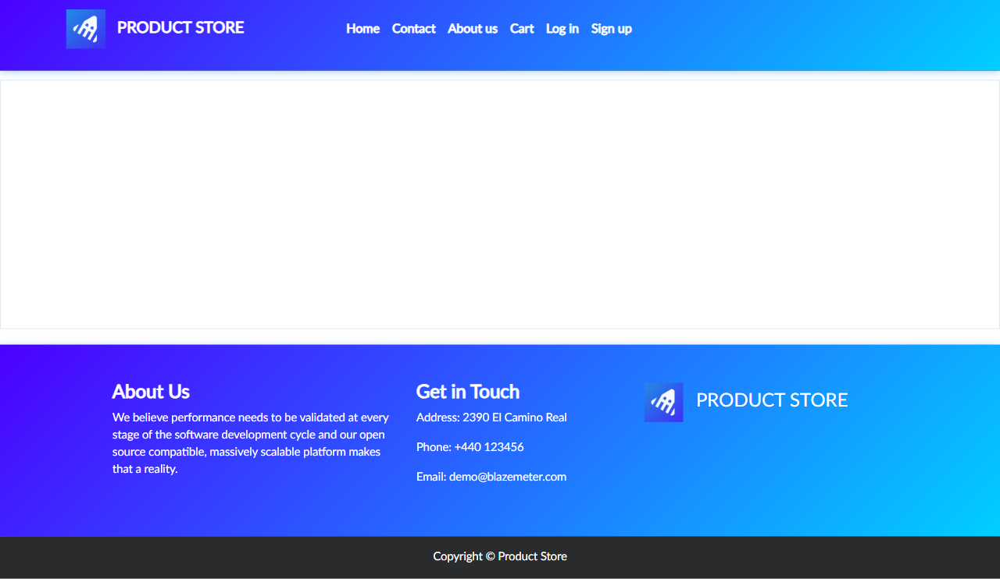

# Laboratorio 01 — Fundamentos de Calidad + Setup de Playwright

**Universidad:** Universidad Mariano Gálvez de Guatemala

---

### 👤 Información del Estudiante

- **Nombre:** Wilson Eduardo Hernández López
- **Carné:** 1790-22-7315
- **Curso:** 048 — Aseguramiento de la Calidad del Software
- **Versión de Node.js:** v22.22.0

---

## Descripción

Proyecto de automatización de pruebas configurado con Playwright + TypeScript, aplicado sobre la tienda demo [demoblaze.com](https://www.demoblaze.com). Incluye 3 tests que verifican:

1. Que la página principal carga correctamente (título y barra de navegación).
2. Que el menú de categorías es visible.
3. Que la barra de navegación contiene los enlaces esperados.

## Cómo ejecutar los tests

```bash
npm install
npx playwright install
npx playwright test
```

## 📷 Evidencia de Ejecución - Tarea 1: Configuracipon de entorno

<details>
<summary>📁 1. Proyecto configurado con los 3 test ejecutándose correctamente</summary>




</details>

## 📷 Evidencia de Ejecución - Tarea 2: Navegación, estrategias de espera y capturas de pantalla.

Capturas generadas por los tests de `tests/clase02.spec.ts`.

<details>
<summary>📁 1. Navegar al carrito y regresar al inicio</summary>


</details>

<details>
<summary>📁 2. Navegar a la categoría Phones y ver un producto</summary>



</details>

<details>
<summary>📁 3. Capturar el navbar y el footer por separado</summary>


</details>

<details>
<summary>📁 4. Verificar tiempo de carga de la página</summary>

Este test no genera capturas: solo mide el tiempo de carga con `Date.now()` y valida que sea menor a 10 segundos, imprimiendo el resultado en consola (`console.log`).

</details>

## 🧠 Reflexión

Ver [REFLEXION.md](REFLEXION.md): auto-wait vs. sleep().